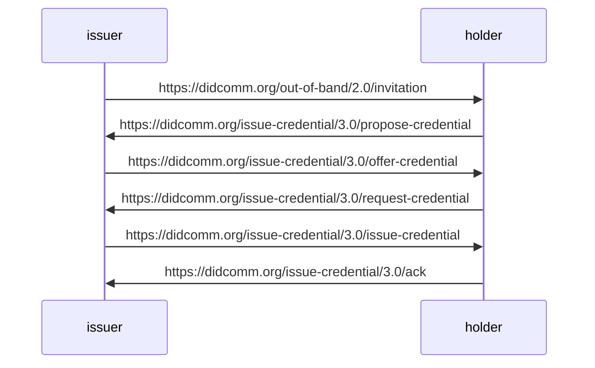

# JFF Plugfest #2 - DIDComm Issuance

This is the flow for issuance of an Open Badge v3 Verifiable Credential (VC) for the Jobs for the Future (JFF) plugfest #2 that focuses on the issuance of VCs.

The sequence has been taken from the [WACI-DIDComm](https://identity.foundation/waci-didcomm) Interop Profile

